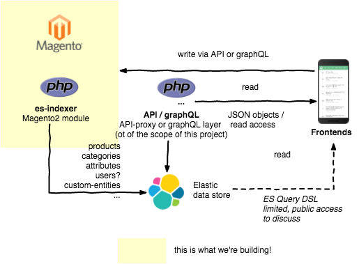

# es-indexer - Elastic Search Data Rich Indexer
Data-rich ElasticSearch indexer, for those who would love to work with Magento on the backend but would prefer to use NoSQL power on the frontend.

## Motivation
Progressive Web Apps, Headless eCommerce, Single Page Applications, graphQL, Microservices, Reactive web - these technology trends are changing the way eCommerce developers design and develop their sites. Our goal is to create the scalable and easy to use NoSQL data store for Magento2. We plan to use ElasticSearch to index (in almost real time) all Magento entities to create the go-to data store for multiple use-cases and scenarios:
- graphQL endpoints for Magento API,
- REST APIs + ElasticSearch DSL,
- Headless and PWA apps (like deity.io, vuestorefront.io or PWA Studio),
- massively scalable and rich product catalogs.

The primary goal is to create a high-speed, and scalable data store for modern eCommerce apps leveraging on the first-class backend features that Magento offers. Additionally, it could be an enabler for developers that, because of some reasons, yet avoided the platform - choosing some "lighter" alternatives.

Although Magento and some 3rd party modules (e.g., Elastic Suite) already support ElasticSearch indexation, our approach is more complicated. The **first challenge** native data indexers that creates the **full SQL database mirror** inside ES indexes (with all EAV structures, attribute dictionaries, categories, extension and custom attributes, taxes, prices). **The second challenge** is to keep this index updated at in almost-real time, to allow application developers to use the data received from ES to support most use cases WITHOUT double-checking the MySQL source of true.

es-indexer is intended to support critical Magento2 features - including:
- product catalog and categories,
- EAV,
- catalog promo-rules, 
- multi-site,
- B2B features (shared catalogs, custom prices), 
- ACLs etc.

Magento 2 Community developers drive this project and all results of this project will be added to Magento 2 Community Edition for free.

## Architecture
Please take a look at the [Project's Wiki](https://github.com/magento-engcom/es-indexer/wiki) to discover the data formats and use cases.

The underlying architecture is simple: we're creating the Magento2 native indexer which takes care of creating ElasticSearch snapshot of all Magento2 entities. Data within ElasticSearch indexed can be accessed directly using ElasticSearch API - but in that case, we cannot support per-user prices or dynamic tax recalculation. To do so there will be an API-level layer of proxy, responsible for instantiating lightweight Magento2 bootstrap and performing the user-authorization and ACL. The proxy is probably out of the scope of this project.

## Contributing
Right now we're in the specification phase - collecting all the Business Requirements, building some PoC of the indexer, discussing data structures with Magento team and code structure of the indexer itself. Would be great to have you onboard! Don't hesitate to join our Slack channel: #feature-es-indexer ([https://magentocommeng.slack.com/messages/C8A4ZRCNS]https://magentocommeng.slack.com/messages/C8A4ZRCNS)